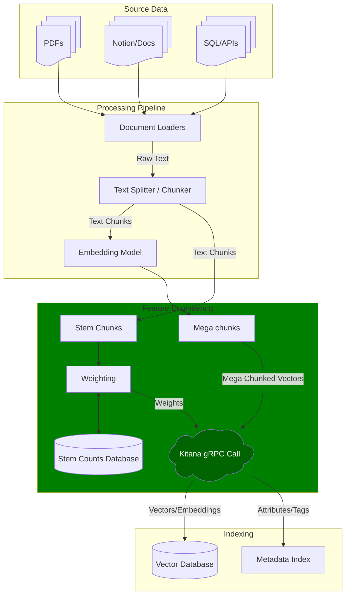

# The Official Kitana™ Python SDK by Morphos AI™

The Kitana Python SDK provides a high-level, "Pythonic" interface for the Green Vectors™ vectorization engine. It handles authentication, automatic token renewal, and client-side validation out of the box.

Additionally, for RAG the SDK includes a weighting mechanism that utilizes **BM25 term frequency** to analyze and compare your corpus, optimizing vector significance.

## ⚠️ **THIS IS A BETA!!!!1** ⚠️

- Weighting may change!
- keep original embeddings and the text they represent in cold/warm storage for reprocessing.
- when reprocessing clear the weighting DB tables.

## Prerequisites

- **Python Version:** Python 3.11 or greater (Tested on CPython 3.11–3.13).
- **Account:** Acquire an account at [https://morphos.ai/](https://morphos.ai/).

### Required Infrastructure

**For Weighting (BM25):**

- PostgreSQL 15 or greater.
*Note: SQLite is supported for local testing/development only.*

**For Storage & Search:**

- A vector database configured for **Euclidean distance** search.

#### Environment Variables

You can configure the SDK using the following optional environment variables:

- `KITANA_DB_URL='postgresql+asyncpg://[user]:[pass]@[host]:[port]'`
- `KITANA_SCHEMA='kitana'` (Defaults to `public` if unset)

## 🚀 Installation

### Install the SDK using the provided wheel file

#### PIP using Wheel

```shell
pip install kitana-0.1.3-py3-none-any.whl
```

#### Astral uv using Wheel

```shell
uv add kitana-0.1.3-py3-none-any.whl
```

### Install the SDK using repo

#### Astral uv using Repo

- Add needed packages for azure
  - Linux/macOS:

    ```shell
    uv tool install keyring --with artifacts-keyring
    export UV_INDEX_KITANA_REGISTRY_USERNAME="kitana"
    export UV_INDEX_KITANA_REGISTRY_PASSWORD="your_token_here"
    ```

  - Windows (PowerShell):

    ```powershell
    $env:UV_INDEX_KITANA_REGISTRY_USERNAME="kitana"
    $env:UV_INDEX_KITANA_REGISTRY_PASSWORD="your_token_here"
    ```

- Add this to pyproject.toml

    ```toml
    [[tool.uv.index]]
    name = "kitana-registry"
    url = "https://pkgs.dev.azure.com/Morphos-AI/kitana-sdk/_packaging/kitana-feed/pypi/simple/"
    ```

- Install Kitana

    ```shell
    uv add kitana==0.1.2
    ```

#### PIP using Repo

- Add the PAT to env vars
  - Linux/macOS
  
  ```shell
  export AZURE_PAT=your_token_here
  ```

  - Windows (PowerShell):

  ```powershell
  $env:AZURE_PAT="your_token_here"
  ```

- Add a pip.ini (Windows) or pip.conf (Mac/Linux) file to your virtualenv

    ```toml
    [global]
    index-url=https://pkgs.dev.azure.com:${AZURE_PAT}/Morphos-AI/kitana-sdk/_packaging/kitana-feed/pypi/simple/
    ```

- Install Kitana

    ```shell
    pip install kitana==0.1.2
    ```

## 🗄️ Database Setup

Before running the ingestion code, you must initialize the weighting database. The SDK uses **SQLAlchemy 2.0 (AsyncIO)**.

1. **Install Drivers:** Ensure you have the appropriate async driver for your database (e.g., `asyncpg` for PostgreSQL).
2. **Run Migration:**

```shell
# Set your schema (optional, defaults to public)
export KITANA_SCHEMA='kitana'

# Run the migration utility
python -m kitana.weighting.migrate_db --url 'postgresql+asyncpg://[user]:[pass]@[host]:[port]'

```

*The schema and necessary tables will be created if they are missing.*

## 🛠️ Basic Usage

The `KitanaClient` is the primary entry point. It manages your gRPC connection and JWT lifecycle automatically.

See the [RAG Ingestion Pipeline Diagram](#diagram) below to understand how Kitana fits into your architecture.

### Core Concepts

1. **StemCountExtractor:** analyzes text to get stem counts needed for weighting calculations.
2. **get_db_weights:** upserts stems to the database and returns documents with calculated weights.
3. **kitanarize:** the core method that processes your vectors.

## Code Examples

### 1. Ingestion Pipeline

```python
from dataclasses import dataclass
from typing import Any
from uuid import UUID

from kitana import AsyncKitanaClient, InputVector
from kitana.weighting.db import get_async_engine
from kitana.weighting.extractor import StemCountExtractor
from kitana.weighting.stem_counts import get_db_weights

# --- 1. Define Data Structures ---

@dataclass
class RichChunk:
    stem_counts: dict[str, int]
    weight: float | None
    vector_embedding: list[float]  # To match protocol
    source_text: str
    # Optional: Track position in source document
    char_start: int | None = None
    char_end: int | None = None

@dataclass
class RichDocument:
    metadata: Any
    file_id: UUID
    chunks: list[RichChunk]


async def kitana_ingestion_example():
    # --- 2. Prepare Documents ---
    
    # Load your docs (implementation depends on your source)
    docs: list[RichDocument] = get_my_documents()

    # Extract stem counts for every chunk
    sce = StemCountExtractor()
    for doc in docs:
        for chunk in doc.chunks:
            chunk.stem_counts = sce.extract_stem_counts(chunk.source_text)
    
    # --- 3. Calculate Weights ---

    # All weighting is calculated relative to an entity_id (e.g., a specific user or department).
    # Use a fixed UUID if you do not need multi-tenancy.
    entity_id = UUID("00000000-0000-0000-0000-000000000000")
    
    # Connect to DB and calculate weights
    engine = get_async_engine()
    async with engine.connect() as conn:
        # Done in one DB call; large batches are recommended for accuracy and performance
        weighted_docs = await get_db_weights(
            conn=conn, entity_id=entity_id, documents=docs
        )

    # --- 4. Process with Kitana (Kitanarize) ---
    
    # Batch size: Adjust based on chunk size, context window, LLM limits, etc.
    batch_size: int = 10

    # Initialize Async Client (Sync client is also available as KitanaClient)
    async with AsyncKitanaClient(username="user", password="pass") as kitana:
        for doc in weighted_docs:
            segment = 0
            
            # Process chunks in batches
            for i in range(0, len(doc.chunks), batch_size):
                batch = doc.chunks[i: i + batch_size]

                # Create a unique facet ID for this segment
                facet_id = f"{doc.file_id}-{segment}"
                input_vectors: list[InputVector] = []

                for chunk in batch:
                    input_vectors.append(
                        InputVector(
                            vector=chunk.vector_embedding,
                            facet_weights={facet_id: chunk.weight}
                        )
                    )

                # Send to Kitana Engine
                results = await kitana.kitanarize(input_vectors=input_vectors)
                
                # --- 5. Storage ---
                # Write the resulting vectors and metadata to your Vector DB
                write_meta_data_and_store_vectors(results)
                
                segment += 1

```

### 2. Retrieval Example

*Note: This example demonstrates how to query your Vector DB (e.g., Qdrant) after you have stored the Kitana vectors. This is not a direct Kitana SDK method.*

```python
def retrieve_vectors(
    self,
    query_embedding: list[float],
    top_k: int = 10,
    distance_percent: int = 20,
) -> list[VectorMetaData]:
    try:
        search_result = self.client.query_points(
            collection_name=self.collection_name,
            query=query_embedding,
            limit=top_k,
        )
        if not search_result:
            return []

        best_score = search_result.points[0].score
        # Calculate dynamic threshold based on the best score
        score_threshold = best_score * (1 + distance_percent / 100)

        vms: list[VectorMetaData] = []
        for hit in search_result.points:
            if hit.score <= score_threshold and hit.payload is not None:
                payload = dict(hit.payload)
                try:
                    vms.append(make_vector_metadata(payload))
                except (TypeError, ValueError):
                    continue # Skip malformed payloads

        return vms
    except Exception as e:
        print(f"Error retrieving vectors: {e!s}")
        return []

```

## 🔍 Advanced Features

### 1. Client-Side Validation

To save network latency and server load, the SDK validates your request locally before sending it. It checks for minimum dimensions (100+), missing data, and integrity.

```python
from kitana import InputVector, ValidationError

try:
    # Example: Vector is too short (needs >100 dimensions)
    bad_vec = InputVector(vector=[0.1] * 50, facet_weights={})
    await client.kitanarize(input_vectors=[bad_vec])
except ValidationError as e:
    print(f"Caught local error: {e}")

```

### 2. Built-in Logging

Enable logging to monitor background tasks like token refreshing and gRPC retries.

```python
import logging
import sys

# Set to INFO for auth events, or DEBUG for raw gRPC traffic
logging.basicConfig(stream=sys.stdout, level=logging.INFO)

```

### 3. Automatic Retries

The SDK is configured with a Service Config Retry Policy. If a call fails due to a transient error (e.g., `UNAVAILABLE` or `INTERNAL`), it will automatically retry up to 4 times with exponential backoff.

### 4. Working with Dataclasses

Results are returned as `FacetVectorResponse` objects, which are easily convertible to standard Python dictionaries.

```python
results = await client.kitanarize(input_vectors=vectors)
data = [r.to_dict() for r in results]

```

## Diagram



## Issues & Bugs

If you notice bugs or have feedback, please [file an issue](https://github.com/morphosai/kitana.SDK/issues).
